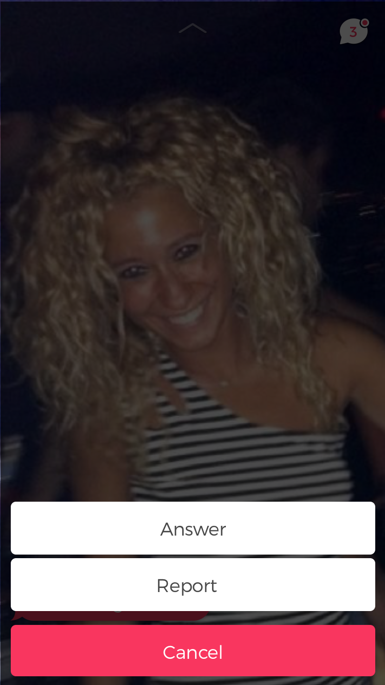

To make the process easier going forward, I've grouped our screens into 5 categories. These are intro, onboarding, menu, discovery and chat. They, for the most part, don't interact with each other and function independently. There are some common elements (components), which are listed in the Components section. I've tried to list everything in the order they appear. I've also tried to make names of things more consistent. Please ping if you see any errors or have questions.

# Categories
## Intro (Root)


## Onboarding

### Form


### Verification
This is a **modal** component. It uses 2 **text button** components.


## Menu

### Menu
There is a **profile loop** component in the background, a **profile photo** component in the upper side and a **icon button** in the footer. 


### Post question

#### Form
There is a **profile loop** component in the background and a **conversation bubble**.


#### Verification
There is a **profile loop** component in the background, a **conversation bubble** and 2 **icon button**s.


### Shoot a loop

#### Shoot
It uses a **icon button**.


#### Verify
There are 2 **icon button**s. On this screen, there is a text timer. The buttons will show up after the the timer is over.


#### No camera access
This is an **information screen** component with a **text button**.


### Discovery Filters


### Settings

#### Main


#### Update School


## Discovery
Discovery has 2 fixed buttons on it: one for going to the upper menu and one for opening the chat screen.

### Profile
Profiles basically have 2 types of common components: **profile loop** and **conversation bubble**. There is also the **answer button**. When touched it pops the keyboard for answer. If it's touched hard or long, it pops a context menu, which is shown below. Keyboard and the **conversation bubble** for answer slides up when triggered. We should also be able to slide up to answer in addition the answer button.

### An unanswered profile


#### Answer screen


#### Context menu


### An answered profile


#### Answer screen


## Onboarding
These appear in the discovery instead of profile's. All of which are **information screen** components.

### Notification permissions


### Ask question


### Shoot loop


## Chat

### List


### Conversation
This has **conversation bubble**s and a **profile photo**.


#### Context

Triggered by the 3 dots in the header.


# Common Components

Only components that are used in multiple screens are listed here.

## Modal

When opened, they blur the background. It renders its children.

## Button

Props: Background color, border color, text color, text
 
## Profile Loop

To be documanted.

## Profile Photo

Props: image, border (int, disabled if 0), border color, onTouch, onLongTouch
Displayes the image inside a circle.

## Conversation Bubble

## Icon button

Props: Background color, border color, icon color, icon

## Information screen

Props: image, headline, description, buttons (Array of buttons)

## Context menu

Props: 
- hasCancel (defaults to true)
- onSelect (returns id on item select)
- items: Array of objects

Touching cancel or outside of the menu closes it.

Item object is strectured like this:

```js
{
	"backgroundColor": "#000",
	"textColor": #fff",
	"text": "Test",
	"id": "test"
}
```